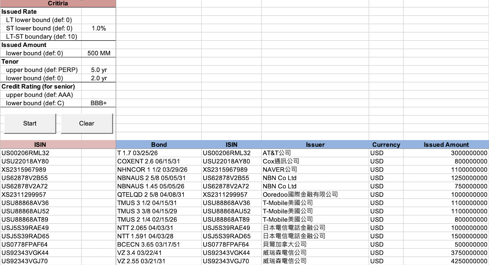
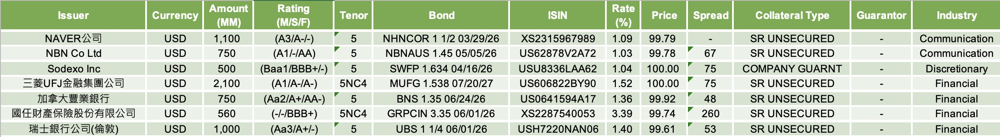

# NIM_Recommendation

## Purpose
The excel file is to screen for the recommended new issue bonds based on your inputted criteria, such as *Issued Rate*, *Issued Amount*, *Tenor*, and *Credit Rating*.
The outputted table would also be categorized by **Collateral type** (Senior or Subordinate) and **Industry** (Non-government or Government).

## Usage
1. Open the file with Bloomberg Terminal
2. Select the **Raw** worksheet
3. Paste ISINs below Range("A20")

4. Input criteria in **criteria table** (if any)
    - Issued Rate
    - Issued Amount
    - Tenor
    - Credit Rating (inputted as S&P rating format)
5. Click **"Start"** button to start running VBA
6. Check the results of recommended bonds in last 4 worksheets

7. Click **"Clear"** button to clear the data in **Raw** worksheet (if finished)